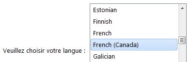

## Gestion des mots de passe {#gestion-des-mots-de-passe}

### Le duo nom utilisateur et mot de passe {#le-duo-nom-utilisateur-et-mot-de-passe}

Nous utilisons quotidiennement des dizaines d’applications Web et mobiles (**Figure 1**). Ces applications tentent de protéger notre vie privée en utilisant une combinaison « nom utilisateur et mot de passe ».

Votre nom utilisateur correspond à votre identité pour un service ou une application que vous utilisez. Un peu comme votre prénom et votre nom de famille vous identifient comme personne. Le plus souvent, le nom utilisateur est soit un pseudonyme ou une adresse courriel personnelle.

Votre mot de passe, quant à lui, est la partie qui sert à vous **authentifier** auprès du service en question. Par exemple, dans la vraie vie, si vous prétendez être Robert Pattinson auprès d’un policier (votre nom d’utilisateur), ce dernier vous demandera sans doute de prouver que vous êtes bien qui vous prétendez être en vous demandant une **pièce d’identité**, comme un permis de conduire ou un passeport.

Votre nom utilisateur est donc habituellement **connu de tous**, il est **public** comme votre prénom et nom, alors que votre mot de passe doit **absolument** demeurer secret (vous ne prêteriez pas votre passeport), sans quoi vos données personnelles pourraient être compromises!

**Figure 1** - Différents services Web

### Propriétés d’un bon mot de passe {#propri-t-s-d-un-bon-mot-de-passe}

Pour qu’un mot de passe soit efficace à protéger votre identité et vos données personnelles, il devrait avoir les propriétés suivantes :

1.  être **unique** à chaque service (oui, oui, un mot de passe différent pour chaque _app_, service, etc.)
2.  être **complexe** (voir liste de mots de passe à éviter)
    1.  au **minimum** six caractères;
    2.  **aucune** information personnelle à votre sujet (surtout pas votre nom utilisateur!);
    3.  un **mélange** de lettres majuscules et minuscules, chiffres et idéalement un symbole;
3.  être **temporaire**, en le changeant occasionnellement (la fréquence dépend du besoin de sûreté)

Bref, le meilleur mot de passe est celui qui est **impossible à retenir**. Nous y reviendrons, car je sais qu’à première vue, ça ne semble pas être une suggestion très pratique!

### Création d’un mot de passe complexe… et mémorisable {#cr-ation-d-un-mot-de-passe-complexe-et-m-morisable}

Créer un mot de passe différent pour chaque application ou service que l’on utilise peut sembler être une tâche impossible. Pour y arriver, il faut se créer une formule de création de mots de passe personnelle. Voici une méthode très simple :

1.  choisissez une base de trois lettres et de deux symboles, par exemple : **K&amp;Ep#**
2.  la base que vous choisirez sera **toujours la même**, pour tous vos services;
3.  ajoutez les 2 ou 3 premières ou dernières lettres du service OU : ajoutez les 2 ou 3 premières voyelles ou consonnes du service, en lisant à partir du début ou de la fin du nom de celles-ci,à votre guise, mais **toujours pareil**.

Si un troisième caractère n’est pas disponible, par exemple, parce que le nom d’un service n’a que deux consonnes et que vous avez choisi les deux premières consonnes pour compléter votre mot de passe, remplacez chaque fois la troisième consonne par le symbole de votre choix, par exemple « % ».

Donc avec notre exemple, voici quelques choix possibles :

**Stratégie choisie Nom du service Mot de passe généré**

Trois premières lettres, du début Gmail K&amp;Ep#gma

Trois dernières voyelles, du début Gmail K&amp;Ep#ai%

Trois premières lettres, de la fin Zotero K&amp;Ep#toz

Trois dernières consonnes, de la fin Zotero K&amp;Ep#rtz

Puisque vous êtes la seule personne à connaitre votre formule (ou algorithme), si un de vos mots de passe était compromis sur un service, les pirates ne pourront pas tester votre mot de passe sur d’autres services, ceux-ci seront donc toujours sécurisés. Puisqu’ils ne connaissent pas la formule que vous avez choisie (lettres, voyelles ou consonnes, à partir du début ou de la fin du nom du service, symbole de remplacement s’il en manque une, etc.), ils seront incapables de deviner vos autres mots de passe.

Ce qui est essentiel, c’est que **votre formule ne change pas**. Cette méthode a donc l’inconvénient qu’il sera impossible, ou assez difficile, de changer périodiquement vos mots de passe sur chaque service.

### Gestionnaires de mots de passe {#gestionnaires-de-mots-de-passe}

Pour simplifier la gestion de nos mots de passe, il existe aujourd’hui plusieurs applications permettant de tous les enregistrer dans une voûte sécurisée pour laquelle il n’y a qu’un seul mot de passe à mémoriser. Ce sont des gestionnaires de mots de passe. De toutes ces applications, celle qui se distingue par sa richesse en fonctionnalités et surtout par sa sécurité est LastPass. _LastPass_ enregistre une version cryptée de vos mots de passe dans le nuage. Ils sont ainsi disponibles de n’importe où, à la condition d’avoir le mot de passe principal. Sans celui-ci, **personne**, même chez LastPass, ne peut avoir accès à vos mots de passe.

### Installation de LastPass au début de chaque cours (moins d’une minute) {#installation-de-lastpass-au-d-but-de-chaque-cours-moins-d-une-minute}

Afin d&#039;utiliser Internet de manière plus **sécuritaire** et **productive**, vous allez créer un compte _LastPass_, auquel vous ajouterez les nombreux comptes d&#039;applications que vous utilisez déjà, ainsi que ceux que nous ajouterons tout au long de la session.

À chaque début de cours, vous suivrez la courte procédure suivante afin d&#039;accéder à votre coffre-fort _LastPass_ :

1.  Lancez le navigateur Firefox (jamais Internet Explorer)
2.  Cliquez sur le menu hamburger en haut à droite, puis sur Modules : suivi de : 
3.  Entrez lastpass dans la boite de recherche de modules (attention de ne pas confondre cette boite de recherche avec celle du navigateur, qui est plus haut dans la barre d’outils) :

1.  Cliquez sur **Installer** à droite du module LastPass Password Manager au haut de la page :

1.  Cliquez sur **Redémarrer** pour relancer Firefox et ainsi compléter l&#039;installation de _LastPass_ :

1.  Lorsque Firefox redémarre, **fermez** l&#039;onglet « Gestionnaire de modules complémentaires » et les fenêtres de bienvenue de _LastPass_.
2.  Cliquez sur la nouvelle icône _LastPass_ dans Firefox :
3.  Vous entrerez alors votre adresse courriel et un mot de passe fort créé à partir de la procédure expliquée à la section précédente pour vous connecter à votre voûte _LastPass_.

Mais la première fois, vous devrez cliquer sur **Créer un compte** :

### Création d&#039;un compte _LastPass (une seule fois)_ {#cr-ation-d-un-compte-lastpass-une-seule-fois}

1.  Dans la première fenêtre, choisissez la langue **French (Canada)** :

cliquez ensuite sur **Créer un compte**.

1.  Dans la case **Courriel** de la fenêtre **Créer un compte**, entrez l&#039;**adresse courriel**, à laquelle vous accédez régulièrement, sans avoir à vous servir de _LastPass_.
2.  Dans la case **Mot de passe principal**, entrez un **mot de passe fort**, c&#039;est-à-dire un mot de passe d&#039;entre huit et douze caractères au hasard, incluant des lettres minuscules et majuscules, ainsi qu&#039;au moins un chiffre et un ou deux caractères de ponctuation tels que &lt;, [, {, ;, -, #, @, etc. Vous pouvez par exemple partir du mot de passe de votre compte courriel régulier et y ajouter deux caractères de ponctuation et quelques chiffres.

**IMPORTANT :** vous devez absolument vous souvenir de ce mot de passe, car il sera requis pour accéder à tous vos autres mots de passe. Au besoin, prenez-le en note **dans un endroit sûr**, sans y inscrire votre adresse courriel, ni le mot « _LastPass_ », bien sûr! **Évitez de le faire si vous pouvez**.

1.  Dans la case **Rappel de mot de passe**, écrivez une phrase ou un message qui pourrait vous aider à vous souvenir de votre mot de passe en cas d&#039;oubli, mais assurez-vous qu&#039;un étranger ne pourrait pas deviner votre mot de passe à partir de cette phrase de rappel!
2.  Cochez la case « **J&#039;ai lu et d&#039;accepte ...** » après avoir lu les conditions de service et la déclaration de confidentialité de _LastPass_. Cochez la case « **Je comprends que mes données chiffrées ...** », décochez « **Garde un historique de mes connexions et formulaires remplis** », et laissez les deux dernières cases cochées, surtout « **Désactiver le gestionnaire de mots de passe de Firefox** » :

Cliquez ensuite sur **Créer un compte**.

1.  _LastPass_ vous mettra en garde qu&#039;il est **INDISPENSABLE** que vous n&#039;oubliez pas votre mot de passe, puisqu&#039;ils ne savent pas quel est votre mot de passe. Personne chez _LastPass_ ne peut connaitre votre mot de passe ou vous le renvoyer, puisque ni votre mot de passe principal, ni vos mots de passe de services et d’applications ne sont enregistrés sur les serveurs de _LastPass_. Ce ne sont que de très longues **chaines cryptées** de chiffres et de lettres qui sont enregistrées sur leurs serveurs.

Entrez votre mot de passe _LastPass_ à nouveau et cliquez sur **Créer un compte**.

1.  _LastPass_ vous offrira d&#039;importer vos données sécurisées et mots de passe existants. Cochez **Non**, puis cliquez sur **Continuer**.
2.  _LastPass_ vous offre ensuite de créer un profil pour remplir automatiquement des formulaires. Pour l&#039;instant, cochez « **Non, je ne veux pas ...** », vous y reviendrez plus tard. Cliquez sur **Continuer**.
3.  LastPass vous félicite pour l&#039;installation et la création de votre compte. Cliquez sur **Continuer**.
4.  Un onglet s&#039;ouvre vous présentant quelques vidéos d&#039;introduction (en anglais).

### Ajouter votre compte Colnet à _LastPass_ {#ajouter-votre-compte-colnet-lastpass}

1.  Assurez-vous d’avoir installé _LastPass_, d’avoir créé votre compte et d’y être connecté;
2.  Cliquez sur l’icône _LastPass_ en haut à droite de votre navigateur Firefox :
3.  Déplacez votre souris vers **Sites**, puis cliquez sur **Ajouter un site**;
4.  Cliquez **Oui** lorsqu’on vous demande si vous êtes sûr de vouloir ajouter manuellement un site;
5.  Dans la case URL, copiez l’adresse suivante : https://portail2.clg.qc.ca/colnet
6.  Dans la case **Nom**, entrez : Colnet
7.  Dans la case **Dossier**, entrez : Lionel-Groulx
8.  Dans la case **Nom d’utilisateur**, entrez : votre **numéro DA** (2017xxxxx)
9.  Dans la case **Mot de passe**, entrez : votre nouveau mot de passe Colnet
10.  Cochez la case **Favoris** pour ajouter ce site à vos sites favoris;
11.  Cochez la case **Connexion Automatique**;
12.  Cliquez sur **OK**.

### Ajouter votre compte Moodle à _LastPass_ {#ajouter-votre-compte-moodle-lastpass}

1.  Assurez-vous d’avoir installé _LastPass_, d’avoir créé votre compte et d’y être connecté;
2.  Cliquez sur l’icône _LastPass_ en haut à droite de votre navigateur Firefox :
3.  Déplacez votre souris vers **Sites**, puis cliquez sur **Ajouter un site**;
4.  Cliquez **Oui** lorsqu’on vous demande si vous êtes sûr de vouloir ajouter manuellement un site;
5.  Dans la case URL, copiez l’adresse suivante : http://clg.moodle.decclic.qc.ca/
6.  Dans la case **Nom**, entrez : Moodle Lionel-Groulx
7.  Dans la case **Dossier**, entrez : Lionel-Groulx
8.  Dans la case **Nom d’utilisateur**, entrez : votre **numéro DA** (2017xxxxx)
9.  Dans la case **Mot de passe**, entrez : votre [nouveau mot de passe Moodle](https://clg.moodle.decclic.qc.ca/pluginfile.php/2/course/section/2/Acces_Moodle_Internet_etud.pdf);
10.  Cochez la case **Favoris** pour ajouter ce site à vos sites favoris;
11.  Cochez la case **Connexion Automatique**;
12.  Cliquez sur **OK**.

### Ajouter votre compte Microsoft OneDrive à _LastPass_ (Outlook / Hotmail) {#ajouter-votre-compte-microsoft-onedrive-lastpass-outlook-hotmail}

1.  Assurez-vous d’avoir installé _LastPass_, d’avoir créé votre compte et d’y être connecté;
2.  Cliquez sur l’icône _LastPass_ en haut à droite de votre navigateur Firefox :
3.  Déplacez votre souris vers **Sites**, puis cliquez sur **Ajouter un site**;
4.  Cliquez **Oui** lorsqu’on vous demande si vous êtes sûr de vouloir ajouter manuellement un site;
5.  Dans la case URL, copiez l’adresse suivante : https://onedrive.live.com/?gologin=1&amp;mkt=fr-CA
6.  Dans la case **Nom**, entrez : OneDrive
7.  Dans la case **Dossier**, entrez : Lionel-Groulx
8.  Dans la case **Nom d’utilisateur**, entrez : votre adresse courriel **Outlook** ou **Hotmail**;
9.  Dans la case **Mot de passe**, entrez : votre nouveau mot de passe **Outlook** ou **Hotmail**;
10.  Cochez la case **Favoris** pour ajouter ce site à vos sites favoris;
11.  Cochez la case **Connexion Automatique**;
12.  Cliquez sur **OK**.

### Ajouter vos autres comptes personnels à _LastPass_ {#ajouter-vos-autres-comptes-personnels-lastpass}

Pour vos autres comptes (Amazon, eBay, Facebook, Gmail, Instagram, LinkedIn, Pinterest, Yahoo!, etc.), assurez-vous simplement d’être connecté à _LastPass_, puis connectez-vous au site en question et lorsque la barre verte apparait au haut de l’écran, choisissez d’enregistrer le site dans _LastPass_ :

1.  Cliquez sur **Enregistrer Site **:

1.  Dans la boite de dialogue qui surgit, entrez les informations suivantes :
2.  Dans la case **Nom**, entrez : le nom du service
3.  Dans la case **Dossier**, entrez : le dossier où le classer
4.  Cochez la case **Favoris** pour les sites que vous voulez pouvoir lancer rapidement;
5.  Cochez la case **Connexion Automatique**;
6.  Cliquez sur **Enregistrer Site**.

### Lancer vos sites essentiels au début d’un cours {#lancer-vos-sites-essentiels-au-d-but-d-un-cours}

Maintenant que vous avez pris quelques minutes pour configurer votre compte _LastPass_ et pour y enregistrer quelques comptes importants dans le cadre de vos études, voici comment lancer ces comptes au début d’un cours :

1.  Lancez le navigateur Firefox et installez _LastPass_;
    1.  cliquez sur le menu hamburger;
    2.  cliquez sur le bouton **Modules**;
    3.  entrez lastpass dans la boite de recherche de modules;
    4.  Cliquez sur **Installer** à droite du module LastPass Password Manager au haut de la page;
    5.  Cliquez sur **Redémarrer** pour relancer Firefox et ainsi compléter l&#039;installation de _LastPass_;
    6.  **fermez** l&#039;onglet « Gestionnaire de modules complémentaires » et les mots de bienvenue.
2.  Cliquez sur la nouvelle icône _LastPass_ dans Firefox ou faites le raccourci clavier **ALT+Tabulation**;
3.  Entrez votre adresse courriel et votre mot de passe dans la boite de dialogue _LastPass_;
4.  Cochez la case **Voir le coffre-fort après la connexion**;
5.  Dans votre coffre-fort, faites un clic droit sur le dossier Favoris et cliquez sur **Tout ouvrir**;
6.  Cliquez Oui dans la boite de dialogue « Êtes-vous sûr de vouloir ouvrir tous les titres? »;

Voilà, en moins d’une minute vous avez ouvert 3 à 8 sites et vous êtes prêts à travailler.